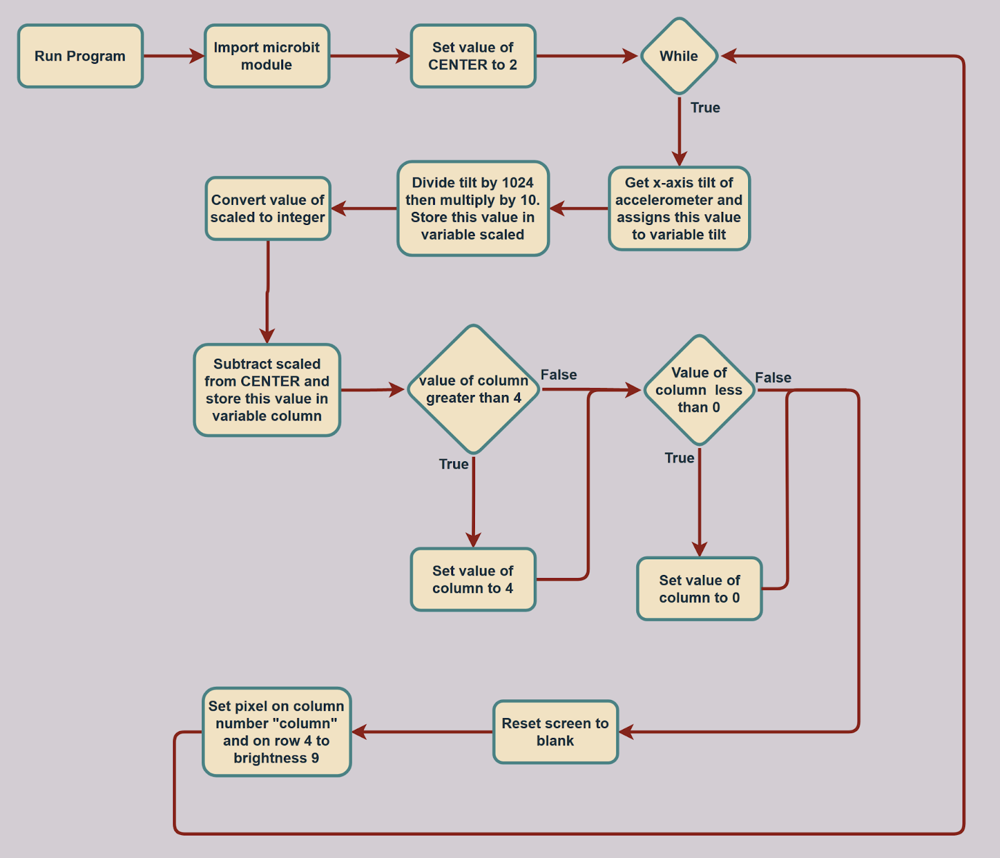

# Microbit_Leveling_Tool

Program Overview: This is a simple level coded in python and runs on the microbit. It dynamically adjusts a pixel on the LED array to show the unevenness of the surface it is placed on and to provide a gauge to which direction the tilt is skewed toward.

New Learnings: One new learning is regarding the display functions. The function, display.clear() turns off all of the LEDs. This function is used in this program to update the screen accurately by turning off the old pixel as the new one is turned on. This ensures that the pixel shown is always representative of the current level of the microbit. Another new display function is the display.set_pixel() function, it sets a specific pixel on or off based on parameters that were passed in. It takes column, row, and brightness parameters. This function is what turns on the pixel according to the data. The column parameter is passed in as a variable and changes based on the tilt level of the microbit, this causes the pixel’s positing to change horizontally indicating the level of the microbit to the user. In addition to the display functions, another new function is the accelerometer.get_x() function, this function measures and returns the x-axis tilt value of the microbit. This provides the actual data that drives the entire program, it is how the microbit knows how it is orientated and how it should move the pixel to accurately show the tilt.

Real-World Connections: A real-world example of the ideas used in this program is regarding the while loop and how it works. The loop in this program constantly takes data from the accelerometer and dynamically adjusts the pixel based on this data. This sort of feedback control loop is used in many things around the world, one very important use case being in-car safety systems. In Teslas, for example, the car uses its various cameras and sensors positioned around the car to analyze its surroundings constantly. This is always looping, then the resulting telemetry is acted on accordingly. For example, if it detects a car in the driver’s blind spot, and the driver has just put on the indicator to go in the car’s direction, the car will analyze all of this data and decide to warn the driver. These sorts of feedback control loops are essential for any automated process, not just in technology but also in humans. Every person right now is using at least one feedback control loop, like the eyes. The eyes let in light from the surrounding environment and send this information to the brain. The brain then interprets this information and does whatever it sees fit.

Applications: One application for the concepts like the feedback control loop and the accelerometer, is making a gyroscopic controller. These controllers aren’t like normal controllers that take inputs through joysticks or buttons, they take analog data using accelerometers. This means that the user doesn’t have to press a button or push around a joystick, they simply have to move their controller around to perform the desired action. There are many use-cases for such controllers, one of them being for Virtual Reality. With the increasing popularity of Virtual Reality, the gyroscopic controller is essential to total immersion. A glove could be made with various accelerometers placed in it, and this data could be used to accurately depict where the user’s hand is in a 3D space. This could then be translated into the virtual world resulting in an extremely accurate 1:1 representation of the real world in the virtual world. Although the controller doesn’t have to be in the form of a glove, it could also be a steering wheel mainly used for car-racing games, or countless other types of controllers. 

